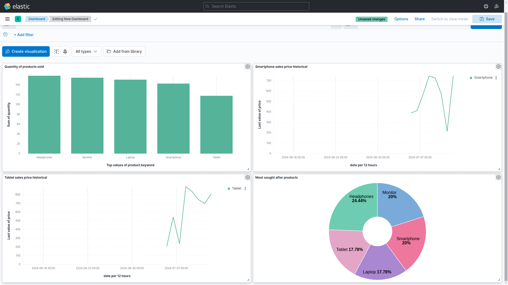

The project captures sales data, tracks errors, and generates insightful visualizations in Kibana. It enables businesses to monitor sales performance, identify top-selling products, and analyze pricing trends, all within a user-friendly dashboard. Ideal for gaining actionable insights and optimizing sales strategies.

